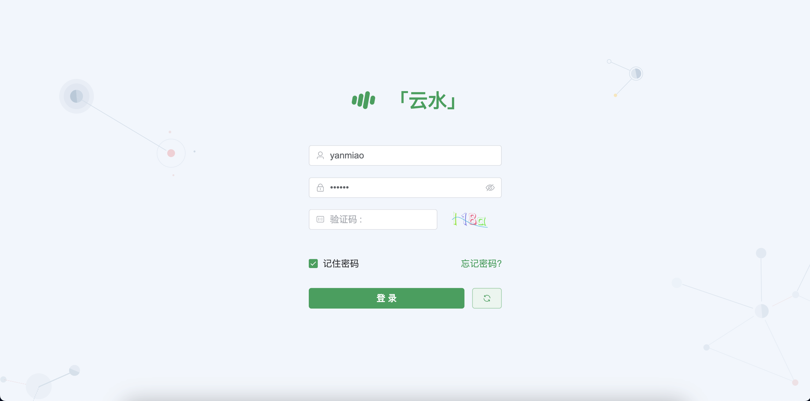
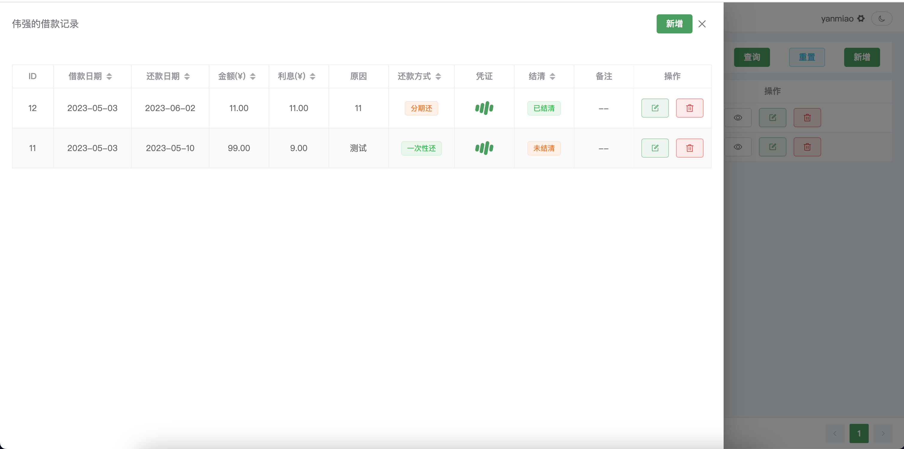

## ⚡ 简介

一个前后端分离的个人备忘录

主要PC端，适合新手用于学习，或者用于做毕设

---

#### 前端：

前端基于 vite 、vue3.2、element-plus、pinia、axios、vue-router、vueuse、scss 等主流技术

#### 后端：

后端基于 node、express、sequelize、mysql、decimal.js、 jsonwebtoken 、passport、multer、nodemon 等主流技术

接口文档 : https://console-docs.apipost.cn/preview/f05a385360ec6990/46163fac28dd9af7

## 🚀 程序下载运行

```git
# npm 版本 v8.5.0
# node 版本 v16.14.2

1、下载项目
	git clone https://github.com/yanmiao99/cat_bill
	tips: 也可以下载zip打开，这样不会和我的仓库关联，也可以自己去解除关联
	
2、打开项目，安装依赖
前端 :
	1. cd client 
	2. npm run install 
	3. npm run dev
后端 : 
	1. cd server
	2. npm run install 
	3. npm run dev (需要nodemon)
数据库 : 
	使用navicat premium 创建一个 cloud_water_db
	账号 : root
	密码 : 12345678
```

## ⭐️ 预览

#### 功能总览

| 模块     | 功能                                         |
| -------- | -------------------------------------------- |
| 首页     | 数据展示                                     |
| 笔记管理 | 笔记列表、分类、新增、编辑、删除、置顶、搜索 |
| 财务管理 | 借出、收入、借款人、新增、编辑、删除、搜索   |
| 个人中心 | 修改密码、退出登录                           |
| 颜色模式 | 明亮、暗黑                                   |

## 🛫 期待

#### 功能开发

1. 首页(开发中)
2. 财务管理 (完成)
3. 笔记管理 (开发中)
4. 常用网站 (开发中)
5. ... 

## 🌈 部署

1. 服务器 : 阿里云/腾讯云
2. oss : 阿里云/七牛云
3. 目前整个网站暂未部署 , 后续可能会部署出来使用

## 👁 部分功能预览







## 🥰 感谢

感谢我所使用的这些技术框架的开发者、维护者，每一个框架、库的开发，都需要长时间的技术沉淀，充分的思考与不断地踩坑。维护开源库所需要花费的时间和精力更是常人所难以想象的。

如果大家喜欢这个项目的话，麻烦大家点个 star、fork，你们的鼓励是我最大的动力。

